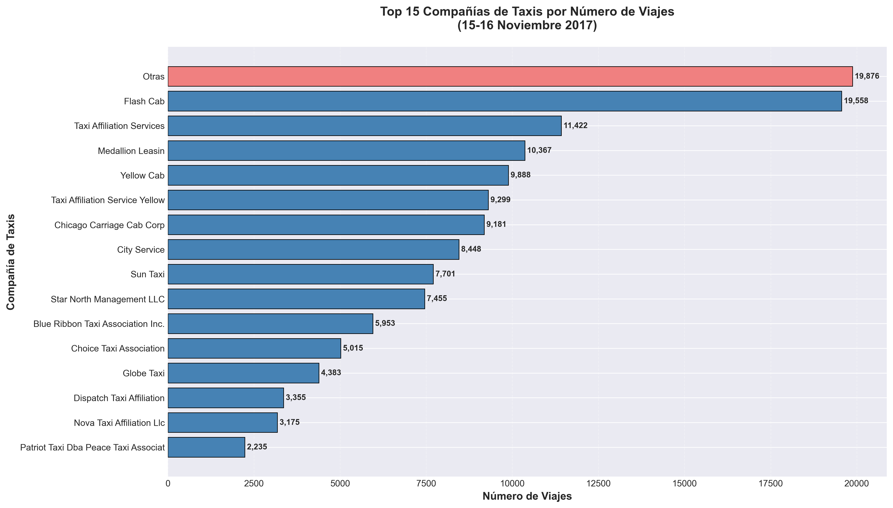
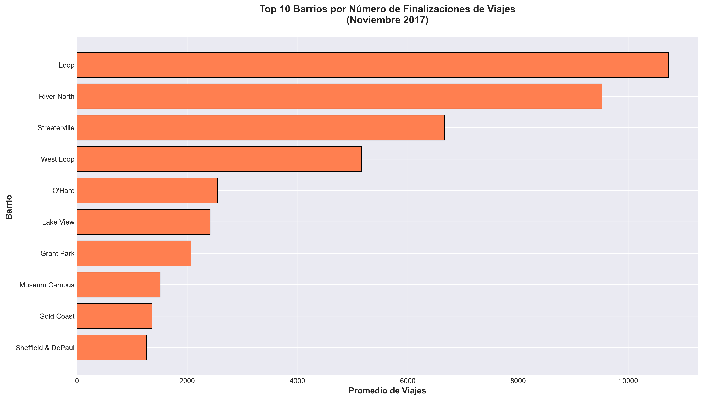
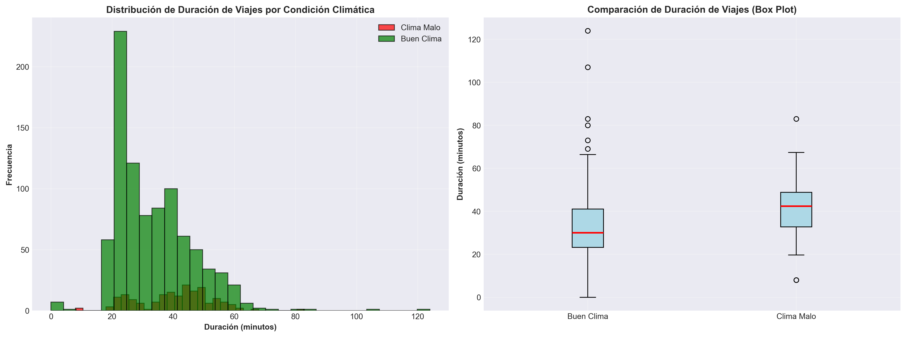

# 🚖 Análisis de Viajes Compartidos en Chicago - Proyecto Zuber

[](https://www.python.org/)
[](https://jupyter.org/)
[](https://pandas.pydata.org/)

## 📋 Descripción del Proyecto

Análisis de datos de **137,311 viajes en taxi** en Chicago (Noviembre 2017) para identificar oportunidades de mercado para Zuber, una startup de ride-sharing. El proyecto combina análisis exploratorio de datos y pruebas estadísticas para entender patrones competitivos, geográficos y climáticos.

---

## 🎯 Objetivos

✅ Analizar el panorama competitivo del mercado de taxis  
✅ Identificar barrios con mayor demanda de viajes  
✅ Validar hipótesis sobre el impacto del clima en tiempos de viaje  
✅ Generar recomendaciones estratégicas basadas en datos  

---

## 📊 Datos Utilizados

### Archivos CSV
- `project_sql_result_01.csv`: Viajes por compañía (15-16 Nov 2017)
- `project_sql_result_04.csv`: Promedio de viajes por barrio (Nov 2017)
- `project_sql_result_07.csv`: Viajes Loop → O'Hare en sábados con datos climáticos

### Variables Clave
- **137,311** viajes totales analizados
- **64** compañías de taxis
- **77** barrios de Chicago
- **1,068** viajes Loop-O'Hare para análisis climático

---

## 🔬 Metodología

### 1. Análisis Exploratorio de Datos
```python
import pandas as pd
import matplotlib.pyplot as plt
import seaborn as sns

# Cargar datos
df_companies = pd.read_csv('data/project_sql_result_01.csv')
df_neighborhoods = pd.read_csv('data/project_sql_result_04.csv')
df_trips = pd.read_csv('data/project_sql_result_07.csv')

# Análisis y visualización
```

### 2. Prueba de Hipótesis Estadística
**Hipótesis**: "La duración promedio de viajes Loop → O'Hare cambia en sábados lluviosos"

- **Método**: Prueba t de Student (muestras independientes)
- **Nivel de significación**: α = 0.05
- **Grupos comparados**: 
  - Clima malo: 180 viajes
  - Buen clima: 888 viajes

---

## 🏆 Resultados Clave

### 📊 Análisis Competitivo

| Compañía | Viajes | % Mercado |
|----------|--------|-----------|
| Flash Cab | 19,558 | 14.2% |
| Taxi Affiliation Services | 11,422 | 8.3% |
| Medallion Leasing | 10,367 | 7.6% |
| Yellow Cab | 9,888 | 7.2% |
| Otras (49 compañías) | 19,876 | 14.5% |

**Insight**: El mercado está fragmentado - **85.8%** no está dominado por el líder

---

### 📍 Top 10 Barrios por Demanda

| Barrio | Viajes Promedio |
|--------|-----------------|
| Loop | 10,727 |
| River North | 9,524 |
| Streeterville | 6,665 |
| West Loop | 5,164 |
| O'Hare | 2,547 |

**Insight**: Los 3 primeros barrios concentran >60% de la demanda

---

### 🌧️ Impacto del Clima

**Resultado de la Prueba de Hipótesis:**
- ✅ **RECHAZAMOS H₀** (p < 0.000001)
- ⏱️ **Diferencia promedio**: **+7.13 minutos** con clima malo
- 📊 **Intervalo de confianza 95%**: [5.18, 9.07] minutos
- 📈 **Tamaño del efecto**: d = 0.57 (mediano)

**Comparación:**
- Clima malo: 40.45 min promedio
- Buen clima: 33.33 min promedio

---

## 📈 Visualizaciones

### Distribución de Viajes por Compañía


### Top 10 Barrios por Finalizaciones


### Comparación de Duración por Clima


---

## 🛠️ Tecnologías Utilizadas

**Lenguajes y Herramientas:**
- Python 3.9+
- Jupyter Notebook

**Librerías:**
```python
pandas          # Análisis de datos
matplotlib      # Visualización
seaborn         # Visualización avanzada
scipy           # Pruebas estadísticas
numpy           # Operaciones numéricas
```

---

## 🚀 Cómo Usar Este Proyecto

### Opción 1: Ejecutar Localmente
```bash
# 1. Clonar repositorio
git clone https://github.com/AlexisLizcano/zuber-chicago-analysis.git
cd zuber-chicago-analysis

# 2. Instalar dependencias
pip install -r requirements.txt

# 3. Abrir Jupyter Notebook
jupyter notebook notebooks/zuber_analysis.ipynb
```

### Opción 2: Ver en Línea

📓 **[Ver Notebook en NBViewer](https://nbviewer.org/github/AlexisLizcano/zuber-chicago-analysis/blob/main/notebooks/zuber_analysis.ipynb)**

---

## 💡 Conclusiones y Recomendaciones

### Hallazgos Principales

1. **Mercado Fragmentado**: Solo el 14.2% está dominado por Flash Cab, dejando 85.8% disponible para Zuber
2. **Concentración Geográfica**: Loop, River North y Streeterville representan la mayor oportunidad
3. **Factor Climático Significativo**: El clima adverso incrementa 7+ minutos los tiempos de viaje a O'Hare

### Recomendaciones Estratégicas

✅ **Lanzamiento Focalizado**: Priorizar cobertura en Loop, River North y Streeterville  
✅ **Pricing Dinámico**: Ajustar tarifas según condiciones climáticas (+15-20% en clima malo)  
✅ **Ruta Premium**: Ofrecer servicio especializado Loop-O'Hare con garantía de tiempo  
✅ **Ventaja Tecnológica**: Integrar datos meteorológicos para predicciones precisas  

---

## 📁 Estructura del Proyecto
```
zuber-chicago-analysis/
│
├── README.md                          # Este archivo
├── requirements.txt                   # Dependencias
├── .gitignore                        # Archivos ignorados
│
├── data/                             # Datos CSV
│   ├── project_sql_result_01.csv
│   ├── project_sql_result_04.csv
│   └── project_sql_result_07.csv
│
├── notebooks/                        # Análisis
│   └── zuber_analysis.ipynb
│
└── images/                           # Visualizaciones
    ├── companies_chart.png
    ├── neighborhoods_chart.png
    └── weather_comparison.png
```

---

## 👤 Autor

**Alexis Gonzalez Lizcano**

- 💼 LinkedIn: [linkedin.com/in/alexis-gonzalez-lizcano](https://www.linkedin.com/in/alexis-gonzalez-lizcano/)
- 🐙 GitHub: [@AlexisLizcano](https://github.com/AlexisLizcano)
- 📧 Email: j.alexis.gl004@gmail.com

---

## 📝 Contexto del Proyecto

Este proyecto fue desarrollado como parte del **TripleTen Data Analytics Bootcamp** (2024-2025), aplicando habilidades de:
- Análisis exploratorio de datos
- Visualización de datos
- Pruebas de hipótesis estadísticas
- Pensamiento analítico para negocios

---

## 📄 Licencia

Este proyecto está disponible bajo la licencia MIT.

---

⭐ **Si encuentras útil este análisis, considera darle una estrella al repositorio!**

---

## 🔗 Enlaces Relacionados

- 📊 [Conjunto de datos original](https://practicum-content.s3.us-west-1.amazonaws.com/)
- 📖 [Documentación de Pandas](https://pandas.pydata.org/docs/)
- 📈 [Guía de Visualización con Matplotlib](https://matplotlib.org/stable/tutorials/index.html)
